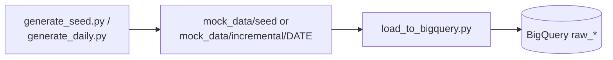
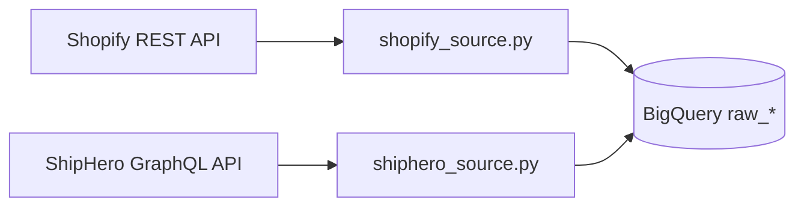

# Ingestion Layer

Two parallel paths into the same `raw_*` BigQuery datasets.

## Mock path — :white_check_mark: Implemented {: #mock-path }

Real, working Python scripts — no live vendor credentials needed:

| Script | Role |
|---|---|
| `ingestion/generate_seed.py` | Generates the initial full mock dataset (JSON) for all 5 sources, keeping IDs consistent across files |
| `ingestion/generate_daily.py` | Generates one day's worth of incremental mock activity |
| `ingestion/schemas.py` | BigQuery `SchemaField` definitions for every raw table |
| `ingestion/load_to_bigquery.py` | Loads a batch of JSON (seed or incremental) into `raw_*` datasets — full refresh or append mode |

This has been run end to end — `raw_shopify`, `raw_shiphero`, `raw_swym`,
`raw_loop`, and `raw_klaviyo` are populated in `mashburn-analytics-dev`, and
dbt has successfully connected to and queried them (source freshness tests
pass). See [Data Modeling](../data-modeling/overview.md) for the caveat on
what dbt actually *does* with that data today.

## Production path — dlt — mixed status

Real API pulls via [dlt](../services/dlt.md), one pipeline per source, each
independently deployable as a container. See
[Data Sources](../data-sources/overview.md) for per-source detail and
[Services & Tools](../services/evaluated-not-chosen.md) for why dlt was
chosen over a managed ELT platform (Fivetran/Airbyte/Portable/Hevo).

| Source | Path | Status |
|---|---|---|
| Shopify | `ingestion/dlt/shopify/` | :jigsaw: Scaffolded — REST API, not yet run against a live store |
| ShipHero | `ingestion/dlt/shiphero/` | :jigsaw: Scaffolded — GraphQL API, not yet run against a live account |
| Loop Returns | — | :clipboard: Planned |
| Swym | — | :clipboard: Planned |
| Klaviyo | — | :clipboard: Planned — not yet even researched for connector options |

### Why Shopify and ShipHero look different

Shopify's Admin API is REST, so `shopify_source.py` uses dlt's declarative
`rest_api_source` helper — config dict, no custom HTTP code.

ShipHero's public API is **GraphQL** (a single `/graphql` endpoint), which
dlt's REST helper doesn't fit. `shiphero_source.py` is a plain `@dlt.resource`
generator that POSTs queries with `requests` and walks cursor pagination
(`edges` / `pageInfo.hasNextPage`) by hand — the standard dlt pattern for
GraphQL, since a dlt resource is just a Python generator underneath.
ShipHero access tokens also expire every 28 days, so the pipeline stores a
refresh token and exchanges it for an access token on every run instead of
managing a static key.

Full detail: [Shopify source](../data-sources/shopify.md),
[ShipHero source](../data-sources/shiphero.md).
