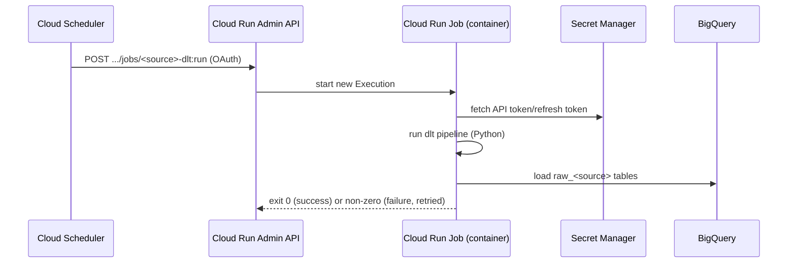

# Orchestration & Deployment

**Status: :jigsaw: Scaffolded.** The full recipe is written and documented
(`ingestion/dlt/DEPLOY.md`); nothing has actually been built/pushed/deployed
to GCP yet — no image, no Cloud Run Job, no Scheduler job, no secret. This
page is the plan to execute once there's a real environment to deploy into.

## Why this shape

Bringing ingestion (and modeling — see [Warehouse & Modeling](warehouse-modeling.md))
in-house doesn't require a heavyweight platform. Four independent,
non-interdependent source pulls don't justify a full orchestrator
(Airflow/Dagster/Cloud Composer) — that machinery earns its cost at
dozens-plus of *interdependent* jobs. Cloud Scheduler + Cloud Run Jobs gets
the same scheduled-execution outcome for a fraction of the operational
overhead, and stays entirely within the GCP project already hosting
BigQuery — same billing, same IAM.

**Tradeoff worth naming:** this shape has no managed retry/alerting UI the
way Airflow or dbt Cloud would give for free. `--max-retries` covers
transient failures, but a real failure (bad credentials, source API schema
change) needs something to actually notice — a Slack webhook or Sentry call
in the pipeline's `except` block is the minimum viable version of that,
and isn't built yet (see [Status & Roadmap](../status.md)).

## Flow

Key point: a Cloud Run Job execution is **fully ephemeral** — no warm/idle
instance sits between runs. The Scheduler call doesn't run anything itself,
it just tells the Cloud Run Admin API "start a new Execution"; that API
call pulls a fresh container from Artifact Registry, runs it once to
completion, and tears it down. Billing is only for the seconds the
container actually ran.

## Components

| Component | Role | Notes |
|---|---|---|
| [Cloud Scheduler](../services/cloud-scheduler.md) | Cron trigger | Calls the Cloud Run Admin API with **OAuth** (not OIDC — OIDC is for hitting your own HTTP endpoints; Google's own `*.googleapis.com` APIs expect OAuth) |
| [Cloud Run Jobs](../services/cloud-run-jobs.md) | Runs the container | One Job per source; any language works, stays Python here since dlt is Python-only |
| [Secret Manager](../services/secret-manager.md) | Holds API tokens | One secret per source, injected as an env var at deploy time — never baked into the image |
| [Artifact Registry](../services/artifact-registry.md) | Hosts container images | One image per source |
| BigQuery | Destination | Same `raw_*` datasets the mock path writes to |

## Identity model (least privilege)

Two separate service accounts, deliberately not shared:

- **Runtime SA** (one per source, or shared) — `bigquery.dataEditor` +
  `bigquery.jobUser` + read access to *that source's* secret only. This is
  what the container runs as; it can't touch anything but BigQuery and its
  one credential.
- **Invoker SA** (one, shared across all sources) — `run.developer` only,
  just enough to call `jobs:run`. This is what Cloud Scheduler authenticates
  as; it can start jobs but can't read secrets or touch BigQuery itself.

## One container per source

Shopify, ShipHero, Loop Returns, and Swym each get their own image, Job,
and secret — deliberately not bundled into one container. A schema change
or outage on one source's API can't block the others' runs. Cost of this:
more moving pieces to set up (mitigated by `DEPLOY.md` being written
generically, parameterized by `$SOURCE`, so adding a new source is a
copy-paste of the same 5-6 `gcloud` commands with a different name).

## Full command sequence

See [`ingestion/dlt/DEPLOY.md`](https://github.com/mdonovan3/mashburn-analytics/blob/main/ingestion/dlt/DEPLOY.md)
in the repo for the exact, copy-pasteable `gcloud` commands: project setup,
image build, secret creation, both service accounts, the Cloud Run Job
deploy, and the Scheduler job creation.
