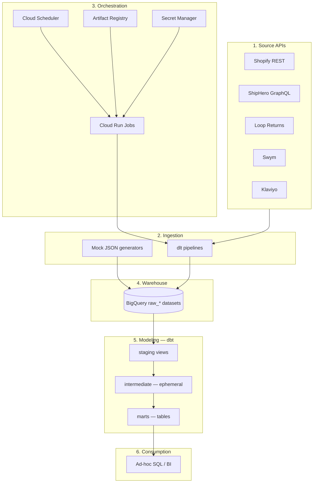

# Architecture Overview

The project has two parallel tracks that share the same warehouse:

1. **Mock track** (:white_check_mark: implemented) — synthetic JSON data,
   generated locally and loaded straight into BigQuery, so the dbt project
   can be built and demoed without any live vendor credentials.
2. **Production track** (:jigsaw: scaffolded / :clipboard: planned) — real
   API pulls via dlt, containerized, triggered on a schedule — designed to
   be what actually replaces an outsourced ingestion vendor.

Both land in the same `raw_*` BigQuery datasets and feed the same dbt
models, so the modeling layer doesn't need to know or care which track
populated a given row.

## Layers

See the [Full System Diagram](system-diagram.md) for the same picture
expanded to every raw table and every dbt model, with hover tooltips and
click-through links.

## Layer detail pages

| Layer | Page | Status |
|---|---|---|
| Ingestion (mock + dlt) | [Ingestion Layer](ingestion.md) | Mixed — see page |
| Orchestration (Scheduler, Run Jobs, secrets) | [Orchestration & Deployment](orchestration-deployment.md) | :jigsaw: Scaffolded |
| Warehouse + dbt | [Warehouse & Modeling](warehouse-modeling.md) | Mixed — see page |

## Design principles behind the production track

- **One container per source.** Shopify, ShipHero, Loop Returns, and Swym
  each get their own image, Cloud Run Job, and secret — so one source's API
  outage or schema change doesn't block the others. See
  [Orchestration & Deployment](orchestration-deployment.md).
- **dlt over a managed ELT platform.** Evaluated Fivetran, Airbyte, Portable,
  and Hevo first (connector coverage varies a lot across these four niche
  sources — see [Evaluated, not chosen](../services/evaluated-not-chosen.md)).
  Landed on dlt (open source, no platform fee) since 2 of 4 sources needed
  custom connectors anyway, and dlt keeps full control in-house rather than
  waiting on a vendor.
- **Serverless over a full orchestrator.** Four independent, non-interdependent
  pulls don't justify an Airflow/Dagster/Composer cluster — Cloud Scheduler +
  Cloud Run Jobs gets the same scheduling with near-zero idle cost.
