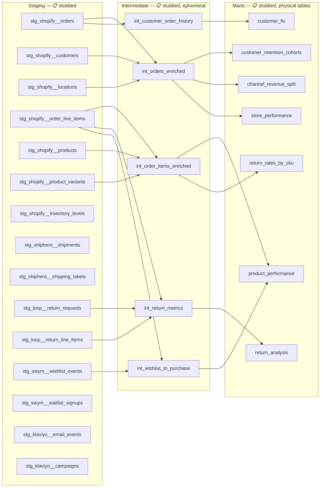

# Full System Diagram

One page, two diagrams, both bigger and more granular than the summary
pictures on [Home](../index.md) and [Architecture Overview](overview.md) —
those show layers; these show the actual tables and model names inside each
layer. Hover any node for a one-line description; click it to jump to the
page that covers it in depth.

Status legend is the same one used [everywhere else on this
site](../index.md#status-legend): ✅ Implemented · 🧩 Scaffolded · 📋 Planned.

## Whole system, source API to BI

Every raw table for every source, both ingestion paths (mock + dlt), the
orchestration pieces that will run dlt in production, all five `raw_*`
datasets, staging/intermediate grouped by source, and all seven marts
grouped by business domain.

```mermaid
flowchart TB
    subgraph SRC["① Source APIs"]
        direction LR
        subgraph SRC_SHOP["Shopify — REST"]
            SHOP_ORD[orders]
            SHOP_CUST[customers]
            SHOP_PROD[products]
            SHOP_VAR[product_variants]
            SHOP_INV[inventory_levels]
            SHOP_LOC[locations]
        end
        subgraph SRC_SHIP["ShipHero — GraphQL"]
            SHIP_SHIP["shipments\n(+ nested shipping_labels)"]
        end
        subgraph SRC_LOOP["Loop Returns — REST, unconfirmed platform"]
            LOOP_REQ[return_requests]
            LOOP_LI[return_line_items]
        end
        subgraph SRC_SWYM["Swym — confirmed live, API unresearched"]
            SWYM_WISH[wishlist_events]
            SWYM_WAIT[waitlist_signups]
        end
        subgraph SRC_KLAV["Klaviyo — REST, usage unconfirmed"]
            KLAV_EVT[email_events]
            KLAV_CAMP[campaigns]
        end
    end

    subgraph ING["② Ingestion"]
        direction LR
        MOCKGEN["✅ Mock generators\ngenerate_seed.py / generate_daily.py"]
        DLT_SHOP["🧩 shopify_source.py\nrest_api_source"]
        DLT_SHIP["🧩 shiphero_source.py\ncustom GraphQL resource"]
        DLT_LOOP["📋 Loop dlt source\nnot started"]
        DLT_SWYM["📋 Swym dlt source\nnot started"]
        DLT_KLAV["📋 Klaviyo dlt source\nnot researched"]
    end

    subgraph ORCH["③ Orchestration — 🧩 scaffolded, undeployed"]
        direction LR
        SCHED[Cloud Scheduler]
        CRJ[Cloud Run Jobs]
        SM[Secret Manager]
        AR[Artifact Registry]
    end

    subgraph RAW["④ BigQuery raw_* datasets — ✅ populated via mock path"]
        direction LR
        RAW_SHOP[("raw_shopify")]
        RAW_SHIP[("raw_shiphero")]
        RAW_LOOP[("raw_loop")]
        RAW_SWYM[("raw_swym")]
        RAW_KLAV[("raw_klaviyo")]
    end

    subgraph STG["⑤ dbt staging — views, 📋 15 models, all stubbed"]
        direction LR
        STG_SHOP["stg_shopify__* (7)"]
        STG_SHIP["stg_shiphero__* (2)"]
        STG_LOOP["stg_loop__* (2)"]
        STG_SWYM["stg_swym__* (2)"]
        STG_KLAV["stg_klaviyo__* (2)"]
    end

    subgraph INT["⑥ dbt intermediate — ephemeral, 📋 5 models, all stubbed"]
        direction LR
        I1[int_orders_enriched]
        I2[int_order_items_enriched]
        I3[int_customer_order_history]
        I4[int_return_metrics]
        I5[int_wishlist_to_purchase]
    end

    subgraph MART["⑦ dbt marts — tables, 📋 7 models, all stubbed"]
        direction LR
        subgraph M_CUST[customer]
            M1[customer_ltv]
            M2[customer_retention_cohorts]
        end
        subgraph M_PROD[product]
            M3[product_performance]
            M4[return_rates_by_sku]
        end
        subgraph M_CHAN[channel]
            M5[channel_revenue_split]
            M6[store_performance]
        end
        subgraph M_RET[returns]
            M7[return_analysis]
        end
    end

    BI["⑧ Ad-hoc SQL / BI"]

    SRC_SHOP --> DLT_SHOP
    SRC_SHIP --> DLT_SHIP
    SRC_LOOP -.-> DLT_LOOP
    SRC_SWYM -.-> DLT_SWYM
    SRC_KLAV -.-> DLT_KLAV
    SRC_SHOP & SRC_SHIP & SRC_LOOP & SRC_SWYM & SRC_KLAV --> MOCKGEN

    SCHED --> CRJ
    AR --> CRJ
    SM --> CRJ
    CRJ -.-> DLT_SHOP
    CRJ -.-> DLT_SHIP

    MOCKGEN --> RAW_SHOP & RAW_SHIP & RAW_LOOP & RAW_SWYM & RAW_KLAV
    DLT_SHOP -.-> RAW_SHOP
    DLT_SHIP -.-> RAW_SHIP
    DLT_LOOP -.-> RAW_LOOP
    DLT_SWYM -.-> RAW_SWYM
    DLT_KLAV -.-> RAW_KLAV

    RAW_SHOP --> STG_SHOP
    RAW_SHIP --> STG_SHIP
    RAW_LOOP --> STG_LOOP
    RAW_SWYM --> STG_SWYM
    RAW_KLAV --> STG_KLAV

    STG_SHOP --> I1 & I2 & I3 & I5
    STG_LOOP --> I4
    STG_SWYM --> I5

    I1 --> M2 & M5 & M6
    I2 --> M3 & M4
    I3 --> M1
    I4 --> M7
    I5 --> M3

    M1 & M2 & M3 & M4 & M5 & M6 & M7 --> BI

    click SHOP_ORD "https://mdonovan3.github.io/mashburn-analytics/data-sources/shopify/" "Shopify orders — id, customer_id, location_id, line_items (nested)"
    click SHOP_CUST "https://mdonovan3.github.io/mashburn-analytics/data-sources/shopify/" "Shopify customers — id, email, orders_count, total_spent"
    click SHOP_PROD "https://mdonovan3.github.io/mashburn-analytics/data-sources/shopify/" "Shopify products — id, title, product_type, vendor, tags"
    click SHOP_VAR "https://mdonovan3.github.io/mashburn-analytics/data-sources/shopify/" "Shopify product_variants — id, product_id, sku, price, inventory_quantity"
    click SHOP_INV "https://mdonovan3.github.io/mashburn-analytics/data-sources/shopify/" "Shopify inventory_levels — inventory_item_id, location_id, available"
    click SHOP_LOC "https://mdonovan3.github.io/mashburn-analytics/data-sources/shopify/" "Shopify locations — the ~15 physical stores"
    click SHIP_SHIP "https://mdonovan3.github.io/mashburn-analytics/data-sources/shiphero/" "ShipHero shipments — GraphQL, refresh-token auth, some mock fields unconfirmed against real API"
    click LOOP_REQ "https://mdonovan3.github.io/mashburn-analytics/data-sources/loop-returns/" "Loop return_requests — state, type, refund/exchange/gift_card"
    click LOOP_LI "https://mdonovan3.github.io/mashburn-analytics/data-sources/loop-returns/" "Loop return_line_items — reason, parent_reason, outcome"
    click SWYM_WISH "https://mdonovan3.github.io/mashburn-analytics/data-sources/swym/" "Swym wishlist_events — empi/epi join keys back to Shopify, customer_email added after a mock-schema gap was found"
    click SWYM_WAIT "https://mdonovan3.github.io/mashburn-analytics/data-sources/swym/" "Swym waitlist_signups — back-in-stock signups, signed_up_at/notified_at/purchased_at"
    click KLAV_EVT "https://mdonovan3.github.io/mashburn-analytics/data-sources/klaviyo/" "Klaviyo email_events — sent/opened/clicked/bounced/unsubscribed"
    click KLAV_CAMP "https://mdonovan3.github.io/mashburn-analytics/data-sources/klaviyo/" "Klaviyo campaigns — subject, status, open_rate, click_rate"
    click MOCKGEN "https://mdonovan3.github.io/mashburn-analytics/architecture/ingestion/" "Real, working — generates all 5 sources' JSON and loads it into BigQuery today"
    click DLT_SHOP "https://mdonovan3.github.io/mashburn-analytics/data-sources/shopify/" "Declarative rest_api_source — scaffolded, not yet run against a live store"
    click DLT_SHIP "https://mdonovan3.github.io/mashburn-analytics/data-sources/shiphero/" "Hand-rolled GraphQL resource, 28-day refresh-token exchange"
    click SCHED "https://mdonovan3.github.io/mashburn-analytics/architecture/orchestration-deployment/" "Cron trigger for each dlt Cloud Run Job — scaffolded, not deployed"
    click CRJ "https://mdonovan3.github.io/mashburn-analytics/architecture/orchestration-deployment/" "One job per source, so one source's failure doesn't block the others"
    click RAW_SHOP "https://mdonovan3.github.io/mashburn-analytics/services/bigquery/" "Untouched copy of the source API response — no renaming, no logic"
    click STG_SHOP "https://mdonovan3.github.io/mashburn-analytics/data-modeling/staging/" "7 views — currently SELECT 1 AS stub, TODO comments spec the real rename/cast logic"
    click STG_SHIP "https://mdonovan3.github.io/mashburn-analytics/data-modeling/staging/" "2 views, incl. UNNEST of nested shipping_labels"
    click STG_LOOP "https://mdonovan3.github.io/mashburn-analytics/data-modeling/staging/" "2 views"
    click STG_SWYM "https://mdonovan3.github.io/mashburn-analytics/data-modeling/staging/" "2 views — renames empi/epi/cts into product_id/variant_id/created_at"
    click STG_KLAV "https://mdonovan3.github.io/mashburn-analytics/data-modeling/staging/" "2 views"
    click I1 "https://mdonovan3.github.io/mashburn-analytics/data-modeling/intermediate/" "orders + customers + locations — one row per order with channel, city, location name"
    click I2 "https://mdonovan3.github.io/mashburn-analytics/data-modeling/intermediate/" "order_line_items + products + product_variants — one row per line item"
    click I3 "https://mdonovan3.github.io/mashburn-analytics/data-modeling/intermediate/" "orders aggregated by customer_id — lifetime_orders, lifetime_revenue"
    click I4 "https://mdonovan3.github.io/mashburn-analytics/data-modeling/intermediate/" "return_requests + return_line_items + order_line_items — days_to_return, resolution type"
    click I5 "https://mdonovan3.github.io/mashburn-analytics/data-modeling/intermediate/" "The one non-trivial model — time-ordered wishlist-add-before-purchase join"
    click M1 "https://mdonovan3.github.io/mashburn-analytics/data-modeling/marts/" "Lifetime value, tier, acquisition channel — one row per customer"
    click M2 "https://mdonovan3.github.io/mashburn-analytics/data-modeling/marts/" "Monthly cohorts, repeat purchase rate at 90/180/365 days"
    click M3 "https://mdonovan3.github.io/mashburn-analytics/data-modeling/marts/" "Sell-through, wishlist conversion, in_ann_loves_lately flag — one row per product"
    click M4 "https://mdonovan3.github.io/mashburn-analytics/data-modeling/marts/" "Return rate by SKU — is it a size/fit pattern?"
    click M5 "https://mdonovan3.github.io/mashburn-analytics/data-modeling/marts/" "eCommerce vs. POS revenue split by month"
    click M6 "https://mdonovan3.github.io/mashburn-analytics/data-modeling/marts/" "One row per store per month — which of ~15 stores punch above their weight"
    click M7 "https://mdonovan3.github.io/mashburn-analytics/data-modeling/marts/" "Exchange vs. refund vs. credit mix, top reason, avg days to return"
```

Solid arrows are working today; dashed arrows are designed but not yet
executed — same convention as the [Home](../index.md) diagram.

## Zoom in: the full dbt DAG, model by model

The diagram above collapses staging into one box per source (`stg_shopify__*
(7)`). This one expands every staging, intermediate, and mart model
individually, with the real `ref()` edges described on the
[Data Modeling](../data-modeling/overview.md) pages — useful for seeing
exactly which stub has to become real SQL before a given mart can run.

Unresolved edges worth flagging while reading this diagram: `int_return_metrics`
is documented as feeding only the `returns` mart, even though
`return_rates_by_sku` (a `product` mart) logically needs return counts by SKU
too — that gap is real in the current docs, not smoothed over here. See
[Marts](../data-modeling/marts.md) if picking this up.

## More detail elsewhere on this site

| Zoom into | Page |
|---|---|
| Mock ingestion path, running today | [Ingestion Layer](ingestion.md#mock-path) |
| dlt pipeline internals (Shopify REST vs. ShipHero GraphQL) | [Ingestion Layer](ingestion.md) |
| Cloud Scheduler / Cloud Run Jobs / container recipe | [Orchestration & Deployment](orchestration-deployment.md) |
| BigQuery partitioning, clustering, nested-field handling | [Warehouse & Modeling](warehouse-modeling.md) |
| Per-source tables, API shape, connector research | [Shopify](../data-sources/shopify.md) · [ShipHero](../data-sources/shiphero.md) · [Loop Returns](../data-sources/loop-returns.md) · [Swym](../data-sources/swym.md) · [Klaviyo](../data-sources/klaviyo.md) |
| Staging/intermediate/marts model specs | [Staging](../data-modeling/staging.md) · [Intermediate](../data-modeling/intermediate.md) · [Marts](../data-modeling/marts.md) |
| Cross-source customer join (Swym/Klaviyo email → Shopify) | [Customer Identity & Conversion Tracking](customer-identity.md) |
| Why dlt over Fivetran/Airbyte/Portable/Hevo | [Managed vs. Self-Hosted](managed-vs-self-hosted.md) |
| What's real vs. stubbed, in one table | [Status & Roadmap](../status.md) |
