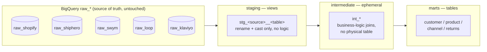

# Warehouse & Modeling

Bringing the process in-house covers both **ingestion** (getting data into
BigQuery — see [Ingestion Layer](ingestion.md)) and **modeling** (turning
raw data into trustworthy, reusable business metrics — this page). Both are
part of the same in-house transition, not separate efforts.

## Layered dbt architecture

- **Staging**: one view per source table. Rename to snake_case, cast types,
  derive nothing. `stg_<source>__<table>` naming.
- **Intermediate**: ephemeral (compiled inline, no physical table) —
  business-logic joins across staging models. Not queried directly.
- **Marts**: physical tables, one schema per business domain
  (customer/product/channel/returns), built to answer specific questions.

See [Data Modeling](../data-modeling/overview.md) for the full model-by-model
breakdown, including the current status of each layer — the folder
structure and source/test scaffolding are built, but as of now the actual
SQL logic in staging/intermediate/marts is still TODO-stubbed rather than
real. That's the next concrete piece of work on the modeling side of the
in-house build-out.

## BigQuery-specific decisions

- **Partitioning & clustering** defined in dbt `config()`, not raw DDL —
  keeps the physical layout as code, reviewable in the same PR as the model.
- **Filter on the partition column**, not a derived expression
  (`WHERE DATE(created_at) >= ...`, never `WHERE EXTRACT(YEAR ...) = ...`)
  — the latter defeats partition pruning and scans the whole table.
- **Nested/repeated fields** (Shopify `line_items`, ShipHero `shipping_labels`)
  stay as `ARRAY<STRUCT>` through staging and get `UNNEST` where a flat
  grain is needed, rather than flattening at ingestion time — keeps the
  raw layer a faithful copy of the source API response.

Full BigQuery reference: [services/bigquery.md](../services/bigquery.md).
