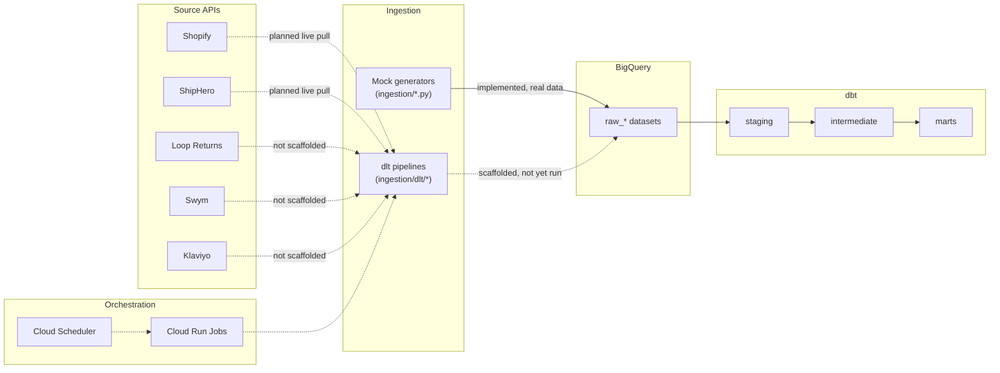

# Mashburn Analytics

A mock dbt + BigQuery analytics platform modeled after the Sid Mashburn data
ecosystem, plus a proposed production-grade ingestion architecture designed
(and partially built) alongside it. This is preliminary planning — drafted ahead of a potential offer for the
Data Engineer role, so there's a concrete starting point for the real thing
on day one rather than a blank page. Bringing ingestion in-house from an
outsourced vendor is expected to be part of the actual job, so the
production track here (dlt + Cloud Run Jobs, see
[Architecture](architecture/overview.md)) is aimed directly at that, not
just a generic exercise. Covers the full loop: source APIs → ingestion →
warehouse → modeled marts → business answers.

## Status legend

Used consistently across this site:

| Badge | Meaning |
|---|---|
| :white_check_mark: **Implemented** | Real, working code — run and verified |
| :jigsaw: **Scaffolded** | Code/config written and structurally complete, not yet executed against a live target |
| :clipboard: **Planned** | Not started |

## The ecosystem, in one picture

Solid arrows are working today; dashed arrows are designed but not yet
executed. See [Architecture Overview](architecture/overview.md) for the
layer-by-layer breakdown, or the [Full System Diagram](architecture/system-diagram.md)
for every table and model name, hover tooltips, and links into per-source/per-model detail.

## Quick orientation

- **[Architecture](architecture/overview.md)** — how the pieces fit together, from source API to business mart
- **[Data Sources](data-sources/overview.md)** — the 5 systems this project models, and real-world connector research for each
- **[Data Modeling](data-modeling/overview.md)** — the dbt layering: staging → intermediate → marts
- **[Services & Tools](services/overview.md)** — short reference docs for every tool/service involved, including ones evaluated and rejected
- **[Status & Roadmap](status.md)** — single-table rollup of what's real vs. planned

## Where the code lives

| Area | Path |
|---|---|
| dbt project | `models/`, `seeds/`, `macros/`, `tests/`, `analyses/` |
| Mock data generation + loading | `ingestion/*.py` |
| Production-style dlt pipelines | `ingestion/dlt/<source>/` |
| Container + deploy recipe | `ingestion/dlt/DEPLOY.md` |
| BigQuery / R / DataGrip connection info | `CONNECTION.md` |

This documentation site is built with [MkDocs](services/overview.md) +
Material — run it locally with `mkdocs serve` from the repo root (see the
main [`README.md`](https://github.com/mdonovan3/mashburn-analytics#readme)
for setup).
